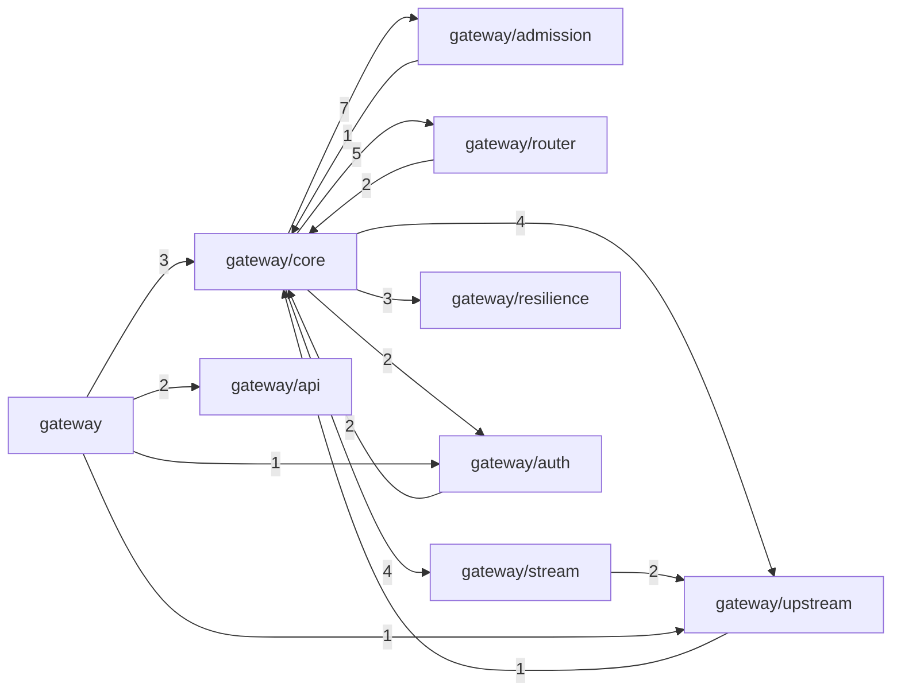

# Граф кода

Выгружается из индекса CodeGraph командой
`uv run python tools/export_codegraph.py`.

Сама база (`.codegraph/codegraph.db`) в репозиторий не кладётся:
она локальна для машины, стареет при первой правке и конфликтует
при слиянии. Здесь — её версионируемая выжимка, которая меняется
вместе с кодом, поэтому расхождение с реальностью видно в ревью.

Индекс: **1010 узлов**, **2828 связей**, из них в `gateway/` — 419 узлов.

---

## Зависимости между пакетами

Построено по связям `imports`: они разрешаются однозначно.
Стрелка означает «импортирует». Число — количество связей.

**Направление связей — проверка архитектуры на месте.** `core`
собирает цепочку и потому импортирует всех. Подсистемы
импортируют только `core` (домен и конфигурацию) — это и есть
слоистость: любую из них можно тестировать отдельно, не поднимая
остальные. Появление стрелки между двумя подсистемами означало бы,
что слой протёк.

Единственное исключение — `stream → upstream`: конвейеру нужен тип
события потока. Зависимость от типа данных, а не от поведения.

---

## Что тронуть опаснее всего

Символы с наибольшим числом входящих вызовов: правка любого из
них задевает много мест, поэтому изменения здесь требуют
отдельного внимания.

Оговорка о точности: вызовы разрешаются по имени символа, поэтому
одноимённые методы разных классов могут склеиваться. Имена, у
которых это заведомо так (`get`, `put`, `stats` и подобные),
исключены, но список эвристический — считайте это подсказкой,
а не доказательством.

| Символ | Где | Вызывающих |
|---|---|---:|
| `upstream` | `gateway/admission/load.py:161` | 12 |
| `prompt_text` | `gateway/core/domain.py:107` | 6 |
| `load_metric` | `gateway/admission/load.py:116` | 5 |
| `_refill` | `gateway/admission/quota.py:46` | 5 |
| `block_hashes` | `gateway/router/prefix.py:36` | 5 |
| `load_of` | `gateway/router/base.py:83` | 4 |
| `upstreams_for` | `gateway/core/config.py:267` | 3 |
| `allows` | `gateway/resilience/breaker.py:101` | 3 |
| `hit_len` | `gateway/router/prefix.py:122` | 3 |
| `_to` | `gateway/resilience/breaker.py:181` | 3 |
| `load_now` | `gateway/core/registry.py:84` | 2 |
| `should_reject` | `gateway/admission/load.py:218` | 2 |
| `all_upstreams` | `gateway/admission/load.py:172` | 2 |
| `matches` | `gateway/core/config.py:43` | 2 |
| `apply_calibration` | `gateway/router/base.py:126` | 2 |
| `as_dict` | `gateway/core/config.py:248` | 2 |
| `build_strategy` | `gateway/router/strategies.py:358` | 2 |
| `_breaker_config` | `gateway/core/gateway.py:124` | 2 |
| `estimate_tokens` | `gateway/router/prefix.py:32` | 2 |
| `settle` | `gateway/core/gateway.py:292` | 2 |

---

## Символы по модулям

### `gateway/admission/load.py`

Классы: `EWMA`, `UpstreamLoad`, `LoadEstimator`  

### `gateway/admission/queue.py`

Классы: `QueuedRequest`, `QueueFull`, `QueueTimeout`, `PriorityQueue`, `SelectiveDispatcher`  

### `gateway/admission/quota.py`

Классы: `TokenBucket`, `QuotaDecision`, `QuotaLedger`  

### `gateway/api/schema.py`

Классы: `ValidationError`  
Функции: `parse_chat_request`, `error_body`

### `gateway/app.py`

Функции: `create_app`, `_startup`, `_shutdown`, `chat_completions`, `_collect`, `models`, `healthz`, `readyz`, `metrics`, `admin_state`

### `gateway/auth/resolver.py`

Классы: `AuthError`  
Функции: `resolve`, `authorize_model`

### `gateway/core/config.py`

Классы: `RuleWhen`, `RateLimitRule`, `FallbackRule`, `SLOConfig`, `RouterConfig`, `AdmissionConfig`, `ResilienceConfig`, `CalibrationConfig`, `GatewayConfig`  
Функции: `field_covers`, `_when`, `load_config`, `expand_env`, `repl`, `_read_yaml`, `validate`

### `gateway/core/domain.py`

Классы: `ServiceClass`, `Message`, `Tenant`, `ChatRequest`, `Upstream`  

### `gateway/core/gateway.py`

Классы: `AdmissionRejected`, `GatewayResponse`, `Gateway`  
Функции: `settle`, `ready`, `body`

### `gateway/core/registry.py`

Классы: `ConfigRegistry`  
Функции: `_is_blocking`

### `gateway/resilience/breaker.py`

Классы: `BreakerState`, `BreakerConfig`, `_Window`, `CircuitBreaker`, `BreakerRegistry`  

### `gateway/router/base.py`

Классы: `RoutingDecision`, `RoutingStrategy`, `RoutingContext`  

### `gateway/router/prefix.py`

Классы: `PrefixTable`  
Функции: `estimate_tokens`, `block_hashes`, `common_prefix_len`

### `gateway/router/strategies.py`

Классы: `_RoundRobinTiebreak`, `LeastLoadStrategy`, `ConsistentHashStrategy`, `SessionStrategy`, `DualMapStrategy`  
Функции: `build_strategy`

### `gateway/stream/pipeline.py`

Классы: `StreamResult`, `StreamPipeline`, `RetryGuard`  
Функции: `flush`, `_schedule_close`, `degradation_notice`

### `gateway/telemetry/metrics.py`

Функции: `render`

### `gateway/upstream/adapter.py`

Классы: `FailureKind`, `UpstreamError`, `UpstreamTimeout`, `StreamEvent`, `Adapter`, `OpenAIAdapter`, `UpstreamResponse`, `UpstreamClient`  
Функции: `classify`, `parse_retry_after`, `get_adapter`, `events`, `close`
